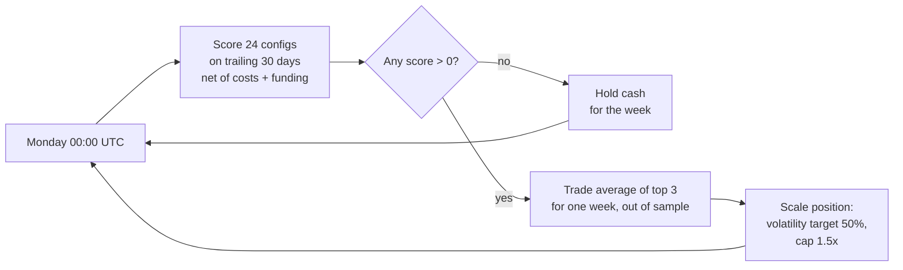
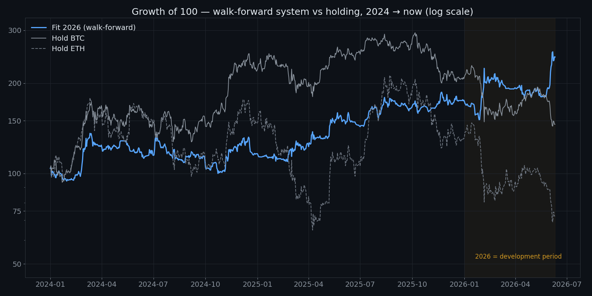
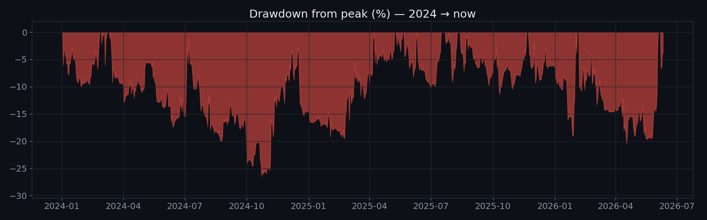
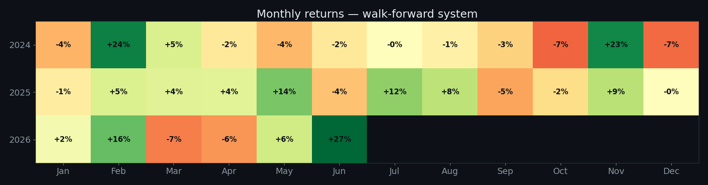
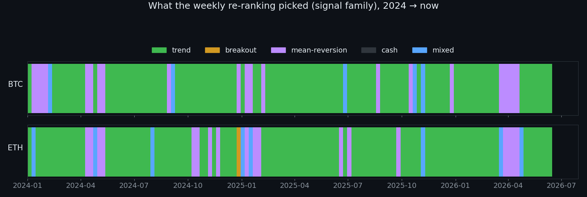
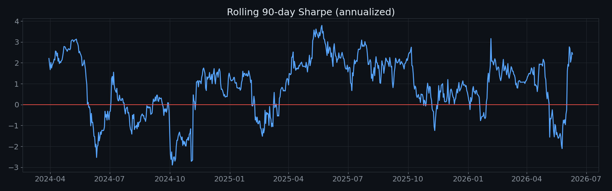
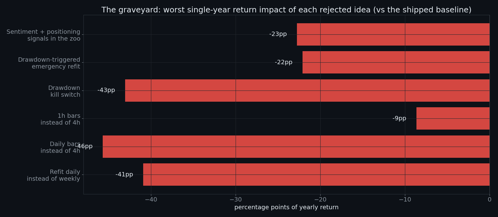

# A walk-forward crypto system, and the seven ideas it killed

**TL;DR** — I built a weekly self-refitting trading machine for BTC and ETH
and ran it as a public paper-trading experiment. Over the full test period
(Jan 2024 → Jun 2026) it returned **+144.5% (+44.2%/yr, Sharpe 1.20 ± 0.64,
max drawdown −28.0%)** versus +46.0% for holding BTC and −27.8% for holding
ETH. The 2026 year-to-date number is +45.1% with a Sharpe of 2.25 — but 2026
is the development period, that Sharpe carries a standard error of ±1.5, and
the honest expectation going forward is much closer to the full-period
number than the headline. Every figure in this document is traceable in
[docs/NUMBERS_LEDGER.md](docs/NUMBERS_LEDGER.md). The most useful part is
probably the [graveyard](#the-graveyard): seven sensible-sounding ideas,
each tested and killed by the data.

## How to read this

This is a research write-up, not a product and not investment advice. The
system was paper-traded on public data. Every headline number is traceable
in docs/NUMBERS_LEDGER.md, and the limitations are stated explicitly in the
'What these numbers don't prove' section and the redaction report. The most
useful part for most readers is the graveyard: seven reasonable ideas the
data rejected.

## Why this exists

I'm a backend/AI engineer. I wanted to know what happens when you take the
boring, honest version of quantitative trading — walk-forward testing, real
costs, real funding, negative results published — and apply it to crypto
with only free data. This repo is the answer, including the parts that
failed. It doubles as my working sample for trading-infrastructure roles
and as the research base for a crypto-data product I'm building.

## How it works

Two coins, BTC and ETH, each running an independent book, equal capital.

Every Monday at 00:00 UTC, each book re-ranks a fixed zoo of 24 simple
configurations — four families: **trend** (moving-average crosses, in
long/short, long-only and short-only variants), **breakout** (channel
breakouts), **mean-reversion** (oscillator and band signals), and **cash**
— by their Sharpe ratio over the trailing 30 days of 4-hour bars, *net of
costs and funding*. It then trades the equal-weight average of the **top
three** for the next week, out of sample. If nothing scores positive, the
book sits in cash.

Two structural choices do most of the risk work:

- **Top-3 averaging instead of top-1.** The single best trailing config is
  the most overfit pick. I learned this the embarrassing way: the top-1
  version's yearly result moved by 12 percentage points when I changed how
  exact score *ties* break. The top-3 basket is immune to that by
  construction.
- **Volatility targeting.** Positions scale to a 50% annualized volatility
  target with a 1.5× cap, so size grows in calm trends and melts away when
  the market turns violent. The same machine without the cap headroom
  returns +30.2%/+37.4%/+12.6% across 2026/2025/2024 — the dial buys ~1.4×
  the size at the same Sharpe, and proportionally deeper drawdowns.

Costs: **0.15% per side on every position change**, charged on the net
position delta. Funding: **real Binance funding events**, timestamped and
signed (shorts receive when longs pay). No price data is assumed beyond
public Binance history, cross-checked against Bybit and OKX.

## Results

**Data through: 2026-06-10** (last bar in the test window; see
[docs/site_snapshot.json](docs/site_snapshot.json)).

Per-year frozen replays (selection restarted each Jan 1, settings frozen):

| Year | System | Max DD | Sharpe | Hold BTC | Hold ETH |
|---|---|---|---|---|---|
| 2024 | **+16.5%** | −28.0% | 0.60 | +121.1% | +46.8% |
| 2025 | **+54.5%** | −11.9% | 1.52 | −6.6% | −11.4% |
| 2026 YTD *(development period)* | **+45.1%** | −21.3% | 2.25 | −29.7% | −44.9% |
| **Full period 2024 → Jun 2026** | **+144.5%** | −28.0% | 1.20 | +46.0% | −27.8% |

Interactive version (hover, zoom, mobile):
**https://akzar1el.github.io/walk-forward-crypto/interactive/equity.html**
(source: [docs/interactive/equity.html](docs/interactive/equity.html)).

> ### What these numbers don't prove
>
> - **2026 is the development period.** Design decisions were made while
>   watching 2026 unfold. The machine's own settings (bar size, refit
>   cadence, training window) were chosen by testing 108 combinations on
>   this same year — only 25% of those cells made money in 2026 and the
>   median cell lost ~18%. The clean evidence is the frozen 2024 and 2025
>   replays, which the machine never saw during design.
> - **The 2026 Sharpe of 2.25 has a standard error of ±1.5** (5.4 months of
>   data). The 95% interval spans roughly −0.7 to +5.2. The full-period
>   Sharpe of 1.20 ± 0.64 is the number I'd plan around, and the true
>   forward expectation is plausibly lower still.
> - **2024 underperformed buy-and-hold badly** (+16.5% vs BTC's +121%).
>   This system earns its keep in flat and falling markets; in a straight
>   bull you'd rather just hold.
> - **Refit-day luck is real.** Re-running with the weekly refit on a
>   different weekday moves yearly results by up to tens of points. Monday
>   ranks top-2 in all three years and is the natural week boundary, but
>   single-year numbers deserve that grain of salt.
> - These are **paper-trading research results**, not audited returns.

## The graveyard

Every idea below sounded reasonable. Each was implemented, tested across
2024, 2025 and 2026, and rejected. Deltas are recomputed fresh against the
shipped baseline (sources in the [ledger](docs/NUMBERS_LEDGER.md)).

**1. Refit daily instead of weekly.** *Why it sounded good:* markets move
fast; re-fit faster, adapt faster. *What the data showed:* −33.7, −40.9 and
−25.9 points across the three years. A 30-day ranking barely changes in a
day; daily refits just churn positions and pay costs. Adaptation speed and
decision quality are different things.

**2. Daily bars instead of 4h.** *Why it sounded good:* fewer bars, less
noise, cheaper. *What the data showed:* −11.8 / −45.7 / −14.8 points. With
daily bars a 30-day window is only 30 observations — too few to rank 24
configs — and exits lag by days. (1-hour bars, for the record, were *not*
clearly worse at current settings — mixed deltas of −8.6/+6.5/−1.4 — just
more churn for no consistent gain. I keep 4h.)

**3. A drawdown kill switch.** *Why it sounded good:* cap the pain — go
flat after an X% drawdown. *What the data showed:* the worst idea tested.
On the current baseline it costs up to −43 points (2026); on an earlier
variant it flipped 2025 from +41% to −12.6%. Crypto drawdowns end in
V-shaped reversals; a kill switch systematically sells the bottom and
watches the recovery from cash.

**4. Drawdown-triggered emergency refits.** *Why it sounded good:* don't go
flat, just *re-decide immediately* when losing — with a confirmation rule
and a cooldown. *What the data showed:* triggers tight enough to fire still
fire at local bottoms (−22 points in 2026); triggers loose enough to be
safe never fire, because vol targeting already contains the episodes. The
weekly schedule plus vol scaling *is* the adaptation mechanism.

**5. Sentiment and positioning signals in the zoo.** *Why it sounded good:*
more information, better picks — Fear & Greed and funding-positioning
signals as extra candidates. *What the data showed:* −13.6 and −22.8 points
in 2024/2025 (2026 alone improved slightly — which is exactly how
overfitting bait looks). Every extra candidate makes a 30-day ranking
easier to fool: the selection step pays for information in noise.

**6. Fixed leverage.** *Why it sounded good:* the edge is positive, so
multiply it. *What the data showed* (in a separate study with intraday
liquidation simulation): every fixed-leverage configuration at 1.5× and
above eventually hit a day that zeroed the account — most of them on
2020-03-12 — after triple-digit best years. Leverage without volatility
scaling isn't a multiplier, it's a countdown. The shipped 1.5× *cap* works
because vol targeting shrinks exposure before storms, not after.

**7. "Know the winners, size them up."** *Why it sounded good:* if you can
tell good trades from bad ones in advance, lever the good ones. *What the
data showed:* across 126 measured weeks the hit rate is 52% — the system
earns through asymmetry (average winning week +4.1%, average losing week
−2.7%), not foresight. Six confluence overlays — basket unanimity,
conviction score, cross-book agreement, trend-efficiency, calm-trend
gating, and real positioning data (open interest, top-trader long/short,
taker flow) — all failed to beat a flat cap. Nothing I could measure
predicts which trades win.

## Engineering notes

- **Free deep-history data is available if you know where it lives.**
  Binance's REST stats endpoints cap at ~30 days, but the
  **data.binance.vision bulk archive** serves the same positioning metrics
  (OI, top-trader and global long/short, taker ratio) as daily files — I
  backfilled 923 days at 4h resolution with zero gaps. The rest of the
  free stack: Deribit DVOL (implied vol, 2021→), DefiLlama stablecoin
  supply (2020→), CFTC COT for CME bitcoin futures (weekly, ~2018→),
  Coinalyze daily aggregates, and basis reconstruction from Binance
  continuous/premium-index klines. None needs a paid key.
- **Clean your klines.** Binance history contains real artifacts: I found a
  $0.0001 print (an empty-order-book wick on Black Thursday 2020) that
  falsely "liquidated" even unlevered backtests until liquidation marks
  were floored to index-style prices. The 4h grid also has eight
  maintenance gaps in 2018–2020 (none after 2023). Cross-checking against
  a second venue is cheap insurance — Binance vs OKX closes agree to a
  median 0.6 basis points, which also proves the strategy isn't a
  data-feed artifact.
- **Funding must be interval-aware.** Binance changed its funding formula
  on 18 Sep 2025 (variable 1/2/4/8h intervals). This pipeline applies
  *individual timestamped funding events* to the bar containing them, so
  it's interval-agnostic by construction; BTC and ETH stayed on 8h
  schedules through the change (verified by event counts).
- **0.15%/side is deliberately conservative.** Binance VIP-0 is 0.1% spot /
  0.05% perp-taker before BNB discounts, and slippage on BTC/ETH at retail size is a rounding error.
  Real execution should beat the backtest's cost assumption, not miss it.

## What I'd test next — status report

- **Top-k ensembling** — *tested and adopted.* Averaging the top-3 ranked
  configs replaced top-1 after the tie-break fragility discovery; it turned
  the untuned years from +11%/−2% to +37%/+13% (unleveraged basis) while
  giving up a little of the development year.
- **A noise-aware selection hurdle** — *tested, rejected.* The max of 24
  correlated trailing Sharpes is positively biased, so I swept hurdles
  (winner must clear τ); τ=2 produced the best 2026 on record and gutted
  2025. The plateau (top-3 averaging) handles selection noise better than
  a gate.
- **Switching hysteresis** — *tested, rejected.* Making the weekly switch
  lazier (incumbent keeps its seat unless beaten by a margin) was a wash at
  small margins and worse at large ones.
- **Rebalance-day tranching** — *measured, not adopted.* The weekday sweep
  shows large dispersion (~33pp), which argues for splitting capital across
  refit days; but Monday is consistently top-2 and tranches would trade
  away expected return for path smoothness I don't currently need. Worth
  revisiting with real capital.
- **Range-based vol estimators** — *partially open.* EWMA vol was tested
  and rejected (the 30-day estimator's lag usefully keeps size small
  through post-spike chop). Parkinson / Yang-Zhang range estimators on 4h
  OHLC remain genuinely untested.

## FAQ

**Does walk-forward optimization work for crypto?**
In this experiment: yes, with weekly cadence, a 30-day window, and brutal
honesty about costs. But 75% of the 108 design combinations I tried *lost
money* in 2026. Walk-forward is a method, not an edge — most settings of it
are still wrong.

**How do you avoid overfitting with 24 strategies in the pool?**
Three ways: trade the average of the top three instead of the single
winner; judge every change on years it wasn't designed on (2024/2025
frozen replays); and publish the rejections. The pool itself never grew —
adding candidates was tested and made things worse.

**Is 0.15% per side realistic on Binance?**
It's conservative. VIP-0 taker fees are 0.1% spot / 0.05% USDT-perp before
discounts, and BTC/ETH books absorb retail size with negligible
slippage. The assumption deliberately overcharges so live results should
beat the backtest.

**Why only BTC and ETH?**
Tested. Adding the largest alts (SOL, BNB, XRP, DOGE — equal-weighted
books) collapsed the development year from +45% to roughly flat in the
worst variant: weak books steal capital from strong ones. The edge
concentrates in the most liquid, cleanest-trending pairs.

**Why didn't a stop-loss / kill switch help?**
Because crypto drawdowns resolve as V-shaped reversals more often than as
slow bleeds. Every drawdown-triggered rule I tested — kill switch,
emergency refit, confirmation-gated variants — sold bottoms. Sizing by
volatility *before* the storm beat reacting after it, every year.

**Can I see which signals it's using right now?**
Family-level, yes — the live dashboard and the weekly ribbon chart show
trend/breakout/mean-reversion/cash per coin per week. Exact parameters are
deliberately not published (see [docs/REDACTION_REPORT.md](docs/REDACTION_REPORT.md)).

**Is this live money?**
No — paper trading against live Binance prices, with fsync'd append-only
trade logs and a public dashboard. The point is the method and the record,
not a brokerage statement.

---

## Work with me

I build trading infrastructure, data pipelines and research tooling like
this for a living.

- Email: **tomi.seregi99@gmail.com** · LinkedIn: **https://www.linkedin.com/in/tomi-seregi/** · Site: **https://tomiseregi.si**
- **Available for trading-infrastructure and data engineering work.**

## License

This case study — text, charts and documentation — is released under the
[MIT License](LICENSE). The underlying strategy source is not part of this
repository (see [docs/REDACTION_REPORT.md](docs/REDACTION_REPORT.md)).

---

*Everything here is educational and informational only. These are
paper-trading research results, not investment advice and not an offer to
manage money. Past performance — simulated or otherwise — does not
guarantee future results. Crypto trading can lose more than you invest.*
